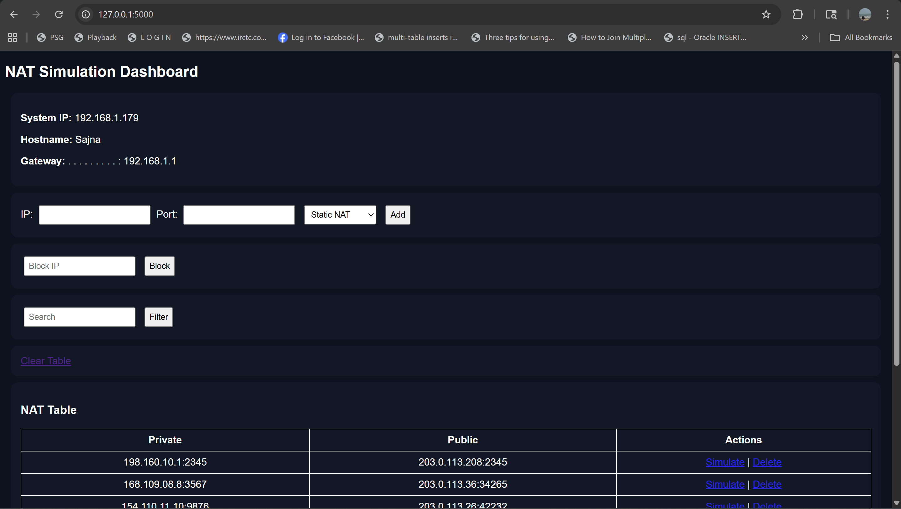
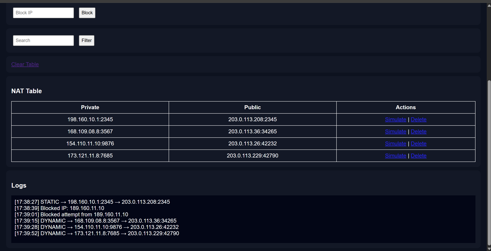
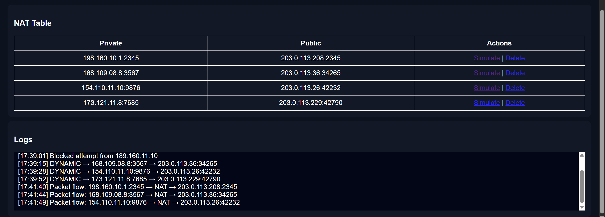
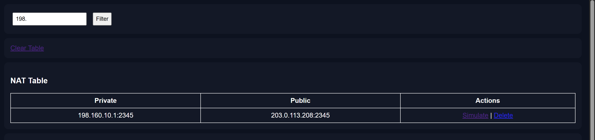

# NAT Web Application

A web-based simulator for Network Address Translation (NAT) built using Flask.

---

## 🚀 Features
- Static NAT mapping
- Dynamic NAT (random public IP + port allocation)
- Multi-IP support
- Packet flow simulation
- NAT rules (block IP)
- Logging system
- System info (IP, hostname, gateway)

---

## 🛠️ Tech Stack
- Python (Flask)
- HTML / CSS
- JSON (storage)

---

## ▶️ How to Run

1. Install dependencies:
   ```bash
   pip install flask

## 📸 Screenshots





